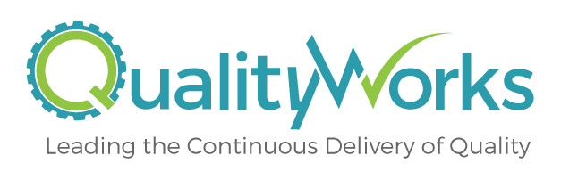
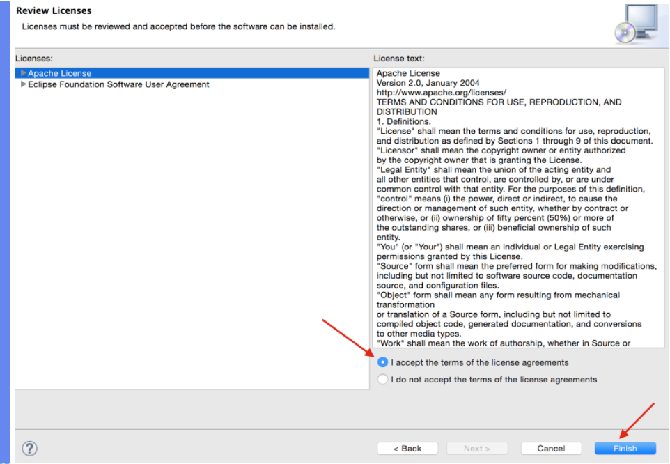
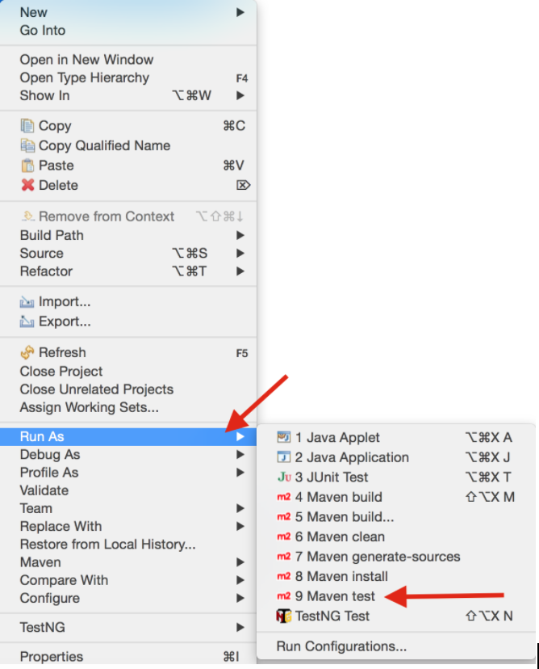

# Java, Maven, TestNG Starter

This is a simple project that would allow anyone to get up and running with Java, Maven, Selenium and TestNG. It also explains how to execute a simple test that will assert the title of a page.

## Getting Started
There are a few things we need before running the tests. These are:

1. Java Installation
2. An IDE / Text Editor (In this example we used Eclipse)
3.  TestNG plugin for Eclipse. (This step may be skipped if you are using another IDE / Text Editor)
4. Project (Clone this repository)

Once the steps above are completed please
1. Import the project into a Text Editor / IDE
2. Run the project

### Java Installation / Update

1. Check your system to see if you have the latest Java version installed.

2. If you do not have the latest Java installed, find out how to install Java [here](https://www.java.com/en/download/help/download_options.xml).

3. Set your `JAVA_HOME` environment to the location of the installed JDK. Find out how to do that [here](https://docs.oracle.com/cd/E19182-01/820-7851/inst_cli_jdk_javahome_t/).

### Setting up Eclipse

Navigate to the [Eclipse download page](https://eclipse.org/downloads/) and download eclipse for Java EE developers.

### Installing the TestNG plugin for eclipse

1. In Eclipse, click on the **Help** menu and select **Install New Software**.

2. Click the 
  * **Add** button
  * Enter **http://beust.com/eclipse** in the **Location**

  

3. Select
  * TestNG
  * Click "Next"

  

4. Select 
  * “Next”, 
  * “Accept the terms of the license agreement”
  * “Finish”

  

  ### Setting up Maven.

  1. Download Maven [here](https://maven.apache.org/download.cgi).

  

  2. Unzip the distribution archive to the directory you wish to install Maven. 
  
  3. Add maven to the PATH. More information can be found in the README.txt in the zip folder

       Here's an example of how I added maven to my PATH on MacOS.
       I added the folowing to the `~/.bash_profile`.

       `export PATH=/Users/admin/Documents/Software/apache-maven-3.5.0/bin:$PATH`

      Then I `source`d (execute) the content of the `~/.bash_profile`
      

       `source ~/.bash_profile`

  4. Run `mvn –version` to verify that maven was installed successfully.

  > Maven dependencies are crucial to running any maven project. They are key references to libraries or various data that a maven project needs to execute properly. The `pom.xml` in the root of a Maven project file stores the dependencies (similar to the `package.json` for Node and `gemfile` for Ruby) for a project.

### Running the Project from Eclipse

Once the project has been imported,  right click the project then select **Run As** then **Maven Tests**.

 

Following the above steps executes the configurations found in the `testing.xml` file by default.

### Running the project from the command line

Navigate to the location of project then execute `mvn test`.